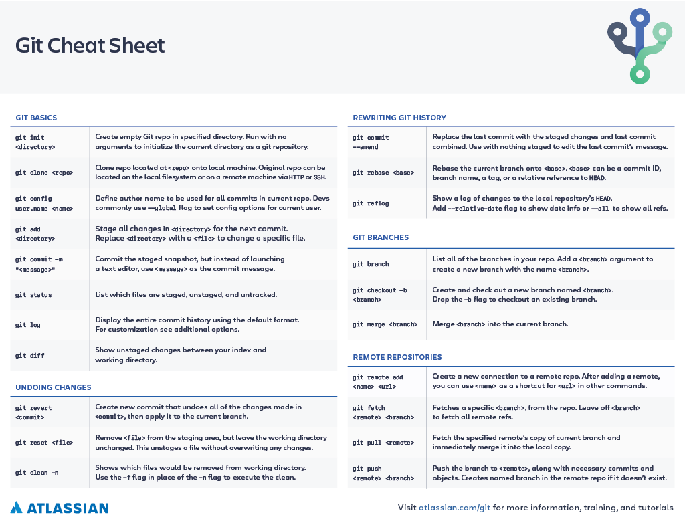
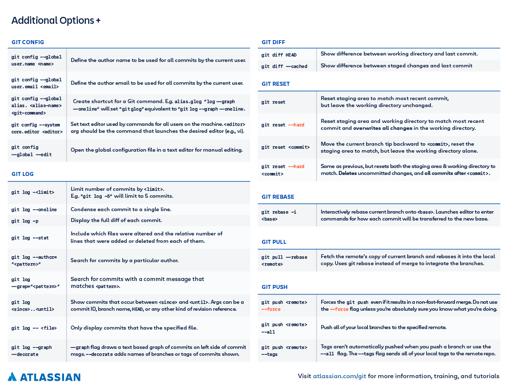

# Git-ting Started

### Summary:
When working in a team environment, version control is essential to keep the codebase readable and in working order during the build season and especially during competition weekends.

## Git Setup
Convientently both the FRC VS Code IDE and IntelliJ IDEA both come with git essentials.

To clone a repository go to [github.com/team4186](https://github.com/team4186) and to the repository you would like to clone. Below you can find a link to the team's home page.

### IntelliJ
1. File > New Project from Version Control
   1. Paste URL and continue

### WPILib VS Code
1. git clone repo
1. File > Open Folder 
   1. Open Root directory containing build.gradle

## Git Branches

During competition weekends

- It is common to work and deploy the dev branch as the turn around time can be usually quick between matches.
- **IMPORTANT** : If you are working on a major feature during competition do not leave half-baked code on dev and create a branch to PR into dev when tested and ready. 

Below is an example working tree. By separating the development tree from our main code we can always have a stable working branch to fall back on if dev is not stable. Feature branches allow for experimental ideas that will allow

- Main --- (Clean and Robot Ready)
    - Dev --- (Work in progress and testing)
        - Feature and/or Personal Branch --- (Experimental working space)

### Reminder: 
If you are on a shared branch, such as dev or main, please use git pull / git merge only. If you are working on a personal branch feel free to use git rebase or git pull to update your branch before a PR.

## Essential Git Commands
- `git status`
  - Useful before pulling to ensure you working directory is clean and will show the file difference comparing to the last local commit
- `git pull`
  - Fetch and download content from a remote repository and update the local repository to match.
  - Combination of two smaller git commands `git fetch` and then `git merge`
  - If the remote repository has changes that work on files you currently have changes on, conflicts are likely.
- `git add <filename>`
  - Staging changes for updating the remote branch
- `git commit -m "Useful git message to describe the work done"`
  - After adding a file or group of file changes, we prepare the commit by adding a message describing work done.
  - After the commit message we are ready to push the changes to remote
- `git push`
  - Push local commits to remote and rectify any conflicts to update remote branch

## Checklist

- [ ] Fetch your current branch before start to work
- [ ] Create a branch to work on your changes
- [ ] Push your changes to the remote at the end of the day so you can access it from any machine
- [ ] Create a PR to merge back to main branch

## More In Depth Resources

### Visual git learning tool: [learngitbranching.js.org](https://learngitbranching.js.org/)

### Atlassian Cheat Sheet

A cheat sheet made by Atlassian with 1 line use case descriptions.

